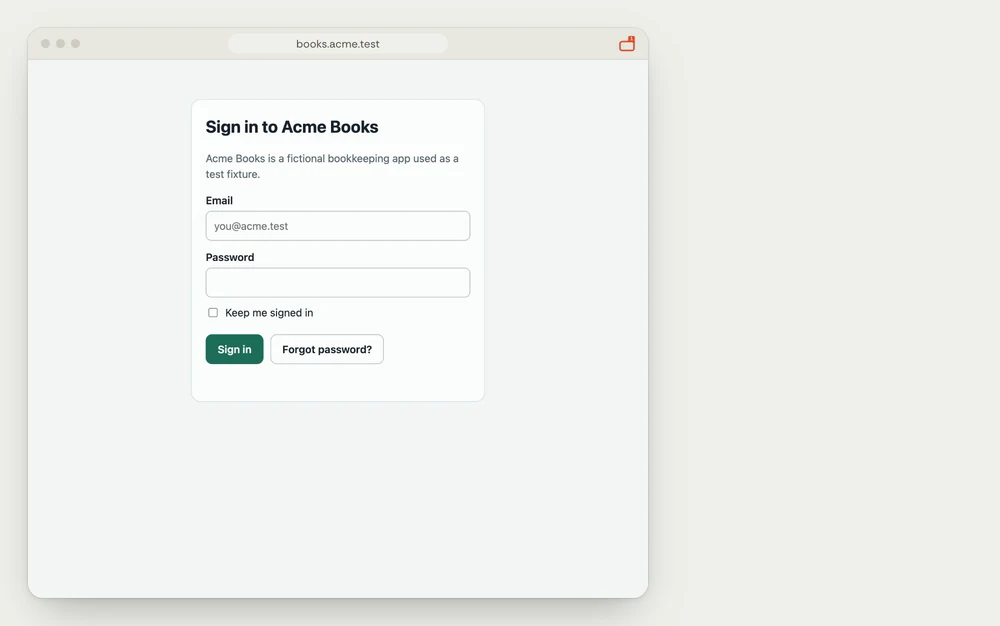
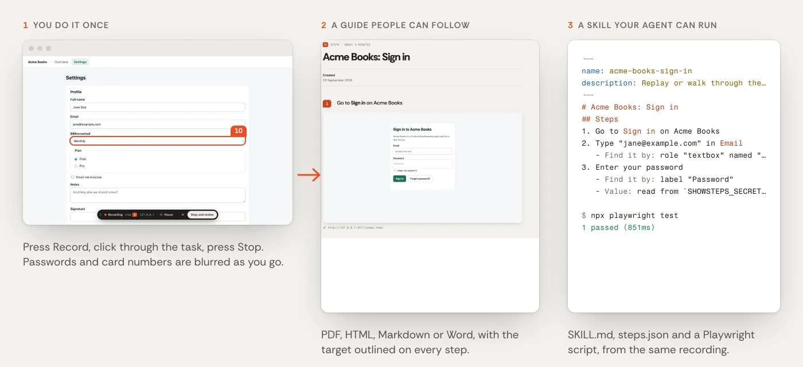
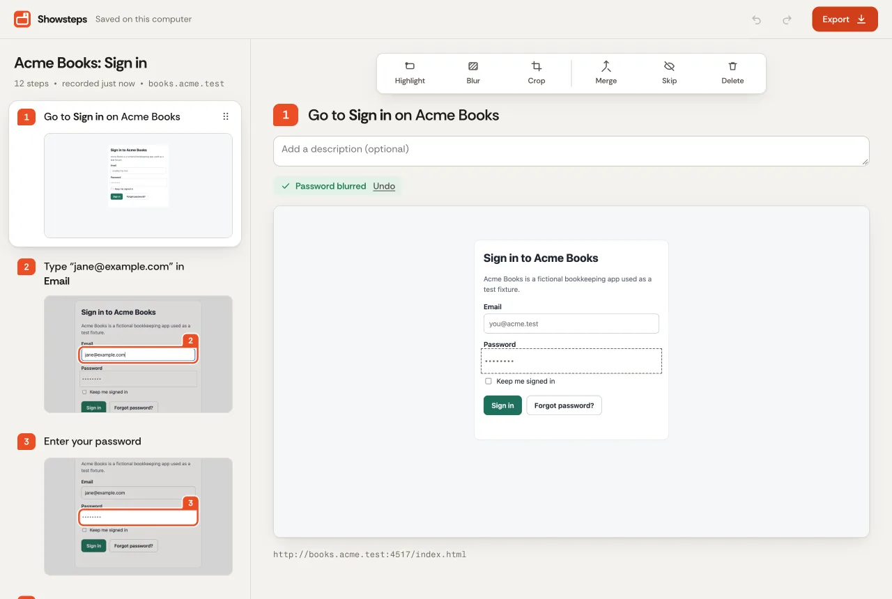
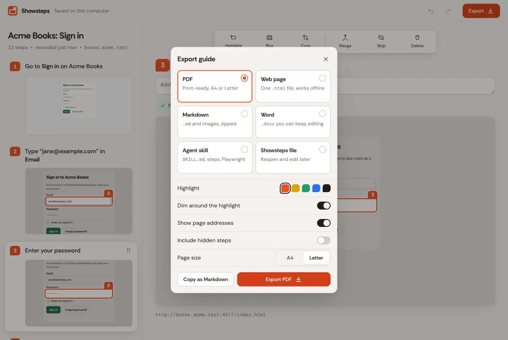
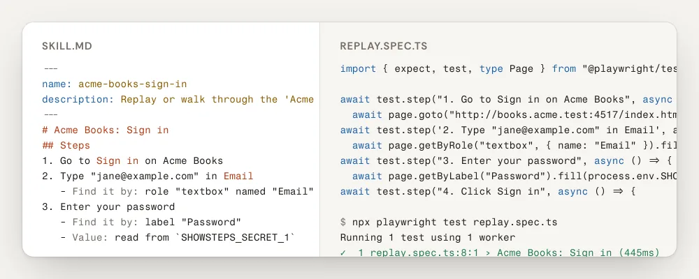

<p align="center">
  <picture>
    <source media="(prefers-color-scheme: dark)" srcset="docs/screenshots/hero-dark.webp">
    
  </picture>
</p>

<p align="center">
  <picture>
    <source media="(prefers-color-scheme: dark)" srcset="packages/brand/logo-on-dark.svg">
    
  </picture>
</p>

<h3 align="center">Do it once. Send the guide.</h3>

<p align="center">
  Showsteps turns a click-through in Chrome into a step-by-step guide with screenshots and the same recording into a skill your agent can replay.<br>
  Free, open source, and everything stays on your computer. No account, no upload.
</p>

<p align="center">
  <a href="#try-it"></a>
</p>

<p align="center">
  <a href="LICENSE"></a>
  
  
  
  <a href="AGENTS.md"></a>
</p>

<p align="center">
  <a href="#before-and-after">Before and after</a> ·
  <a href="#try-it">Try it</a> ·
  <a href="#features">Features</a> ·
  <a href="#for-agents">For agents</a> ·
  <a href="#privacy">Privacy</a> ·
  <a href="#run-and-test">Run and test</a> ·
  <a href="#license">License</a>
</p>

---

## Before and after

You press Record, click through the task once and press Stop. You get a guide a person can follow, and a skill an agent can run, from the same recording.

<picture>
  <source media="(prefers-color-scheme: dark)" srcset="docs/screenshots/before-after-dark.webp">
  
</picture>

Every screenshot, name and value above comes from a mock app ("Acme Books") that ships in [`apps/fixtures`](apps/fixtures).

## Try it

Showsteps runs as a local, unpacked Chrome extension (Chrome 120 or newer; building it needs Node 24 and pnpm 11):

```bash
pnpm install
pnpm --filter @showsteps/extension build     # writes apps/extension/.output/chrome-mv3-production
```

Open `chrome://extensions`, turn on **Developer mode**, choose **Load unpacked** and pick `apps/extension/.output/chrome-mv3-production`. The `.output` folder is hidden: press ⌘⇧. in the file picker to show it, or ⌘⇧G and paste the path.

Then:

1. Open the site you want to document and click the Showsteps icon. The side panel opens.
2. Press **Start recording**. Chrome asks once for access to all sites so Showsteps can follow you across tabs and page changes. You can decline and record a single tab.
3. Do the task. A small bar on the page shows that you are recording. `Alt+Shift+P` pauses and resumes, `Alt+Shift+S` stops.
4. Press **Stop and review**, tidy the steps, and press **Export**.

## Features

- **The Flag.** Every screenshot gets a ring around the element you touched, with a numbered tab on its corner and the rest of the page softly dimmed. The same drawing is used in the editor, the HTML, the PDF and the Word file.
- **Steps written for you.** Clicks, typing (one step per field), selects, checkboxes, key presses and page changes become steps titled like `Click Save` or `Type "jane@example.com" in Email`. Edit any title or add a description.
- **Sensitive values blurred as you record.** Password fields, card numbers, tax IDs, IBANs, API keys and tokens, in fields and in page text, are masked before the screenshot is stored, and typed values in sensitive fields are never saved. Detection looks inside iframes and shadow DOM. Email addresses can be blurred too (a setting, off by default). Every automatic blur has an Undo, and you can blur or crop anything else by hand. Automatic detection is a safety net, so review the screenshots before you share.
- **More than one tab.** A recording follows you into new tabs and across page changes, with pause and resume.
- **An editor that stays out of the way.** Reorder, merge, skip and delete steps, add note steps, move the highlight, in the side panel or a full tab.
- **Export what people actually use.** PDF, a single self-contained HTML file, Markdown with images, Word (DOCX), an agent skill, and a `.showsteps` project file you can open again. Or copy the guide as Markdown. No watermark; a small "Made with Showsteps" line is off unless you turn it on.
- **Light and dark.** Both themes, and exported HTML follows the reader's.

<picture>
  <source media="(prefers-color-scheme: dark)" srcset="docs/screenshots/editor-dark.webp">
  
</picture>

<picture>
  <source media="(prefers-color-scheme: dark)" srcset="docs/screenshots/export-dark.webp">
  
</picture>

## For agents

The recording is a human's account of a task. Your agent can pick it up from there, with no network, no account and no key.

- **Skill export.** `Export` → `Agent skill` (or `--format skill` in the CLI) writes a folder with `SKILL.md` (frontmatter and numbered steps with a "Find it by" hint), `steps.json` (every locator, best first, plus a Playwright snippet per step) and `replay.spec.ts` (a Playwright test for the whole flow). Values typed into sensitive fields were never stored; the skill reads them from `SHOWSTEPS_SECRET_1`, `SHOWSTEPS_SECRET_2` and so on.
- **CLI** (`showsteps`): `validate`, `info`, `steps`, `edit-step`, `regen-titles`, `export`, `new`. `--json` prints one JSON object and nothing else; exit codes are `0` ok, `1` invalid input, `2` usage, `3` file error.
- **MCP server** (`showsteps-mcp`, stdio): `validate_guide`, `guide_info`, `list_steps`, `edit_step`, `regenerate_titles`, `export_guide`, `create_guide_from_steps`.

From a checkout:

```bash
pnpm --filter @showsteps/cli build
node packages/cli/dist/showsteps.js export onboarding.showsteps --format skill --out ./out --json
cp -r ./out/skill ~/.claude/skills/onboarding      # Claude Code picks it up as a skill
```

<picture>
  <source media="(prefers-color-scheme: dark)" srcset="docs/screenshots/agent-skill-dark.webp">
  
</picture>

Everything an agent needs (commands, file layout, MCP setup and worked examples) is in [AGENTS.md](AGENTS.md); the file format is in [docs/schema.md](docs/schema.md).

## Privacy

- Guides, step text and screenshots live in your browser's IndexedDB, on your computer.
- The extension makes no network requests after install: no account, no analytics, no crash reporting, no AI service.
- Permissions are the few it needs: `activeTab`, `scripting`, `storage`, `sidePanel` and `unlimitedStorage`, plus optional access to all sites, requested only when you press Record.
- Exports are files you save. What you do with them is up to you.

The full list, with the reason for each permission, is on the [privacy page](https://showsteps.vercel.app/privacy/).

## Run and test

```bash
pnpm install
pnpm test                   # every package's unit tests
pnpm typecheck
pnpm verify --skip-heavy    # tests, typechecks and the licence check, no browsers
```

The extension is tested end to end: Playwright loads the unpacked build into Chromium and records a 10-step, two-tab flow on the mock site, then checks the steps, titles, highlight boxes, redactions and every export, and replays the exported skill.

```bash
pnpm --filter @showsteps/extension build:e2e   # test build: host access granted at install
pnpm --filter @showsteps/extension e2e         # starts the mock site on port 4517 if it is not running
```

| Folder | What it is |
| --- | --- |
| [`apps/extension`](apps/extension) | The Chrome extension (Manifest V3, [WXT](https://wxt.dev) and React): recorder, capture, storage, side panel, editor, export. |
| [`packages/core`](packages/core) | The guide schema and every exporter (Markdown, HTML, PDF, DOCX, Playwright, agent skill, project file). Pure TypeScript with no DOM. |
| [`packages/dom`](packages/dom) | In-page code: describing the element you clicked, locators, sensitive-field detection. |
| [`packages/cli`](packages/cli), [`packages/mcp`](packages/mcp) | The `showsteps` command and the `showsteps-mcp` server, thin layers over core. |
| [`packages/brand`](packages/brand) | Design tokens, logo and fonts. |
| [`apps/fixtures`](apps/fixtures) | "Acme Books", a mock app used by the tests and the demos. |
| [`apps/site`](apps/site) | The website. |
| [`apps/launch`](apps/launch) | The launch video, this README's hero loop, the store screenshots. `apps/launch/render.sh` regenerates them from the current build. |

## License

[MIT](LICENSE) © 2026 Bilal Tahir.

## Credits

- Fonts: [Rethink Sans](https://fontsource.org/fonts/rethink-sans) and [Fragment Mono](https://fontsource.org/fonts/fragment-mono) for the interface and exported guides, and [Source Sans 3](https://fontsource.org/fonts/source-sans-3) as the PDF fallback for other scripts, all under the SIL Open Font License 1.1, bundled via [Fontsource](https://fontsource.org).
- Built with [WXT](https://wxt.dev), [React](https://react.dev), [pdf-lib](https://pdf-lib.js.org), [docx](https://docx.js.org), [fflate](https://github.com/101arrowz/fflate), [idb](https://github.com/jakearchibald/idb) and [Playwright](https://playwright.dev), all under permissive licences.
- The logo, icons, sample app, screenshots, launch video and its soundtrack are original work released under this project's MIT license. The sample app and its people are made up.

The full list, with licence texts and the soundtrack's provenance, is in [CREDITS.md](CREDITS.md).

## Support

Showsteps is free and always will be. If it saves you time, you can [support the project](https://showsteps.vercel.app/support/).
